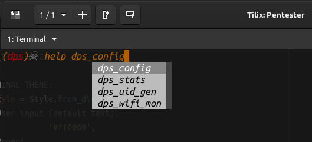
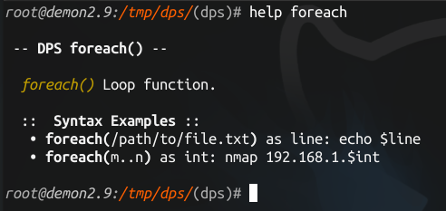
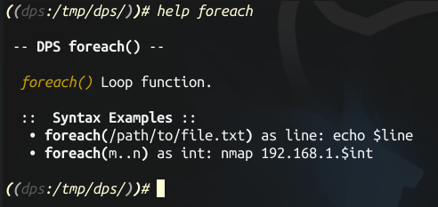

# Demon Pentest Shell
A simple shell wrapper for superior logging capabilities. All commands are logged to ```~/log_dps_history.csv``` with with ```When,Host,Network,Who,Where,What```.
This project requires Python3 and the following Python modules,
* prompt_toolkit # for TAB autocompletion of $PATH and built-in commands
* os # for path object
* sys # for exit
* re # regular expressions
* ifaddr # NIC info
* socket # for hostname
* getpass # for username
* datetime # for dates and times
* subprocess # executes cmds by passing them to `/bin/bash`
* configparser # parses dps.ini file

## The Shell
### Autocomplete Feature

### Built-In Programming Logic

### Shell Themes
These are set with PRMPT_STYL in the `~/.dps/dps.ini` file or with the `dps_config prompt (0-9)` built-in command.
#### DPS Default Theme:
`PRMPT_STYL` value of `0` or `DPS` using `dps_config`


#### Pirate Theme:
`PRMPT_STYL` value of `1` or `PIRATE` using `dps_config`


#### Boneyard Theme:
`PRMPT_STYL` value of `2` or `BONEYARD` using `dps_config`


#### 1980s Theme:
`PRMPT_STYL` value of `3` or `1980S` using `dps_config`


## Example Log Output
Below is example log output for DPS. All logs are located in `~/.dps/` with the date used in the file name. Unlike other terminal s which store command history in as session-like manner, DPS will show the command history of all commands issued within a current day from all terminal sessions.
```
root@demon2.9:/tmp/dps/(dps)# cat ~/.dps/2020-10-18_dps_log.csv                                         
When,Host,Network,Who,Where,What
2020-10-18 11:32:32.253098,demon2.9,ens33:192.168.159.132,root,/tmp/dps,dps_config prompt 3
2020-10-18 11:32:34.377993,demon2.9,ens33:192.168.159.132,root,/tmp/dps,exit
2020-10-18 11:32:40.805349,demon2.9,ens33:192.168.159.132,root,/tmp/dps,ifconfig
root@demon2.9:/tmp/dps/(dps)#                                                                           
```
## Shiny Features
Because this is built with prompt_toolkit, the shell has a lot of great built-in features. 
* Use pipes for stdout, stderr just like you would in a native shell
### Keyboard Shortcuts
The following keyboard shortcuts are available,
* CTRL+A - move the cursor to the beginning of the line
* CTRL+P - enter the previous command into the temrinal
* CTRL+C - exit the shell gracefully
* CTRL+R - search history
* Up and Down arrows - flip through command history
### Built-In Commands
The following are built-in commands,
* dps_uid_gen - generate a list of UIDs from a CSV file
* dps_wifi_mon - set a Wi-Fi device into monitor mode
* dps_stats - show log stats
* dps_config - set configuration options, such as prompt style
* clear - clear the terminal
* cd - change current working directory
* history - view your command history for your current session file (ALL HISTORY)

## Installation
To install DPS, simply install the requirements using pip3 and copy the ```dps.py``` into your ```$PATH``` like ```/usr/local/bin```, etc:
```
root@kali:~# cd /tmp
root@kali:/tmp# git clone https://github.com/weaknetlabs/dps.git
root@kali:/tmp# cd dps
root@kali:/tmp/dps# pip3 install -r requirements.txt
root@kali:/tmp/dps# cp dps.py /usr/local/bin/
root@kali:/tmp/dps# dps.py
```
